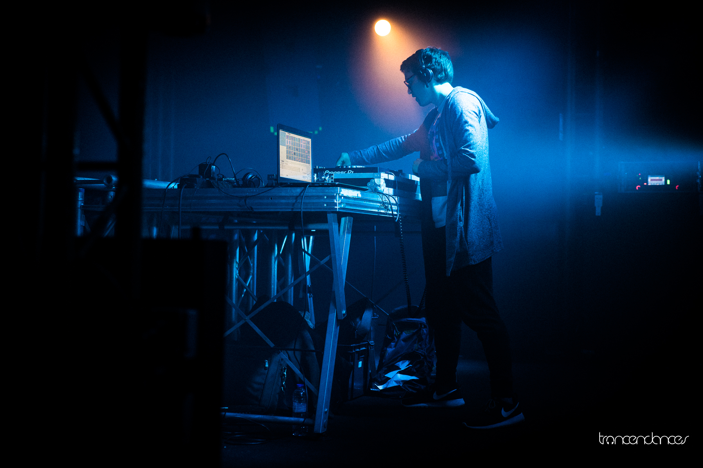

A month ago today, the first edition of *immersion{s}*, a new events brand mainly focused on trance parties in Brest (Brittany), happened. This first edition, as all the next ones will be, are organised by [Trancendances](https://www.trancendances.fr), a French non-profit I co-funded and have been the president of since 2014, focused on promoting trance music all around France.

In the past, we worked on a few events around Paris and promoted others all around the country, but that was the very first event we organised from scratch, as all of the gigs we previously worked on were produced by people outside of our organisation, who sometimes already had some experience with such things, had already handled all the planning and project management.

Organising an event isn't an easy task, and that's even more relevant when it's your first one. It took us over 6 months of hard work to make this one happen, and I'm not even counting all the previous failed attemps. During all that time, up to the few hours after the party ended, we've learned a lot on a lot of topics we sometimes didn't even expect to have to deal with, and this new knowledge is what I'd like to share with you this week.

*[Alex Wackii](https://www.facebook.com/AlexWackiiOfficial/) playing at immersion{s} - photo credit: [Joffrey Lartigaud](http://jlartigaud.fr/) / [Trancendances](https://www.trancendances.fr/)*

## Your party will be a financial failure

Let's take the bad news in first. If the event you're working on is your first one, you're unlikely to earn a single cent from it. There's one really good reason for that: you don't know what you're doing, and even in the friendliest environment, you're likely to screw up more than once. But that's okay.

In my opinion, the best way to learn how to do something is to do it, not with the expectation to crush it but to learn the processes, the rules to follow, who to speak to, etc. And that's exactly what happened with this event. Financially speaking, it was kind of a disaster, since we only sold enough tickets (including at the door) to cover about 50% of our total expenses.

On the other hand, however, we spent the last months creating our own brand, putting together our own team, learning how this kind of stuff is done, who to get in touch with for each specific need, what questions to ask, etc. We tried some stuff that worked and some that didn't (I'll dive deeper in that later), so that now we know how to do some important tasks right because we got them wrong the last time, or because we got them right on the first try. And we learned all of that stuff so tasks that would take us weeks to work out then will only take us five minutes and an email now.

It can be one hard thing to process, because such an event usually costs a lot of money, representing thousands of euros, and you're not likely to make them back, especially if it's your first shot and you don't really know what you're doing. But it's an important thing to be aware of that as early in the process as possible, because it will allow you to set better, more realistic objectives, which will allow you to look at the upcoming event with a better focus on what actually matters: creating reproducible processes, building a team and learning about the local audience and how to interact with it. In my opinion, it's better to see this not as a financial loss, but rather as an investment on successes that will eventually come in the long run.

There's something you can do to avoid losing too much, though, and that's finding sponsors. It might be quite easy or the hardest thing ever depending on the local ecosystem. Sponsoring basically consists in contacting companies, and offering them to give you money to make your event possible in exchange for communication. Although we didn't have any sponsor on this one (because we messed up somewhere with our planning and reached out too late), we did get the opportunity to get in touch with a few potential sponsors with which we might work on future events.

Quite similar to sponsorships are public subventions, which relate to public services. In fact, we got the chance to work in partnership with the city, which promotes local events organisators. Although it's not money we got from them, they handled the renting of the venue and most of the sound and lighting equipment, which represents a saving we estimate at around 1k€ at least (which is a lot, regarding the event's budget).

Both sponsorships and public subventions happen, and some companies or public services might be more than happy to promote your event. Do not hesitate to reach out to as many people as you can, the venue's city, the state, the government, the EU, a big local company, a bank, a clothing brand, etc.. One of the things I've learned not only from this event, but from running Trancendances in general, is that a "no" will very not likely hurt you, and a "yes" might offer you opportunities you've never dreamt of, so do not give up on getting in touch with an entity because "they're too big and I'm too small", "they can't interested in this kind of things", or any other reason. And if you can't think of anything, the way to think of potential sponsors or public services that might support your event would be, in my opinion, to have a look at flyers or posters for other similar events, since sponsorship and public subventions usually involve including some logos there.

## We are human after all

One of the most important part in every project is the people you surround yourself with. Because such a project usually represents a lot of work and efforts, especially if it's your first time, you can't really afford being the only person on board. And for the same reason, you need the people you surround yourself with to be trustworthy, because you can't afford to always be looking over someone else's shoulder.

In the case of *immersion{s}*, we were actually a small team of two people: Raphaëlle, who manages everything related to events at Trancendances, and myself. Fortunately, Raphaëlle and I know each other since we were children, and have been friends since our teenage years, so we both know pretty well how to trust and work with each other. Working in such conditions makes the experience much better, as none of us would ever question the other's work (once we discussed how we were going to do things), and we had quite some fun working together, making what would have otherwise been an exhaustive, stressful and trying experience much more bearable.

In such an adventure, it's the smallest things that matter, such as being able to tell when the others aren't in the mood to work, are going through a difficult time, etc.. Sometimes, a work meeting would turn into a good time between a couple of friends who had some pressure to release, nibbling pistachios and drinking some tea.

One very important thing that you must never forget is that, in the end, an event is just a group of people, usually not even that much, that get along quite well, and are passionate about something they want to share with the rest of the world. It's not technology or money that drives such a machinery, it's the human that work hard behind the scenes, a lot of times even voluntarily, so everyone have a good time.

As part of the organising team, one of your *de facto* responsibilities is to manage the other humans you're working with. Always pay attention at them, see how they're handling the work load and pressure, and be able to detect and react to something going wrong. For example, if one of your teammates is having a hard time in their personal life, and starts panicking over what would appear as a silly thing to you, you need to be able to see it and reassure them, to take the necessary actions so they won't be confronted with the struggle they're panicking about, rather than teasing or making fun of them about it. Working under pressure isn't an easy thing, and not everyone reacts the same way in such conditions. Never mock, always empathise.

On the course of the process, we eventually ended up requiring more pairs of hands, especially on the event's night as there are many things to take care of, such as selling tickets, ensuring the artists have all they need, or other specific tasks depending on the venue, partners, etc.. We reached out to a few friends of ours who offered us their help, who are friends we've known for at least a few years, enough for us to trust them entirely. The result was us being able to carry the event without having to worry a single second about whether someone was doing their job the right way. The carefree feeling it brought was something really amazing, which avoided us ending up having to waste a lot of time looking over everyone's shoulder, and saved us a lot of energy and efforts during the night. For some of these friends, this ponctual help even ended up turning into a longer-term investment as they're joining the permanent team to work with us on future events.

Always trust, always care, and always think bigger; to me, that's how you build a great team.

## Ask the right questions

The most frustrating part about doing something for the very first time is not knowing what you're doing. You might find yourself a crazy amount of times in a position where you realise there's one piece of information you're missing to complete an important task, or that you've been assuming something only to find out that you've wrongly done so, forcing you into improvising while you could have planned the whole thing perfectly if you had only asked.

Situations like these happened quite a lot during the months leading up to *immersion{s}*, from having to open the ticket shop without knowing the room's capacity, to setting the timetable before being made aware of the hours the venue would allow us to play music at, including planning the setting up of a cloakroom before learning, on the event's day, that the venue already had one they operate themselves, and others situations like those.

One great thing to prevent those from happening is, before you even start planning the event, to sit with your teammate(s) and think about how is everything going to work out, as far as you know, and start listing everything you need to know for every step. Here's a little example of what an extract of such a list might look like:

* We want to do a music event at this specific venue

  * What dates would be great for that?

  * How do you book the venue?

  * What's the venue's capacity?

  * When can we access the venue? When do we need to leave?

  * When is the soonest the music can start? When is the latest it needs to stop?

  * Does the venue deduct a percentage from the ticket sales? If yes, how much?

  * Does the venue give us a percentage from the bar's sales? If yes, how much?

  * Does the venue provide us with the security staff and technicians? If not, who do they use to work with?

  * If they don't provide us with the security staff, what are the security requirements: how many people, with what certifications, etc.?

  * Do they operate a cloakroom? If not, is there somewhere at the venue we can set one up during the event?

*  We want to receive some support from the city

  * Who do we need to speak to?

  * What would they offer us?

  * If they rent the venue for us, is there something we need to do, or do they handle that with the venue directly?

  * If they rent the equipment for us, can they provide us with a list of everything that includes? If not, who do we need to ask that to?

  * If the help doesn't consist in them directly giving us money, how much is the help worth?

* [...]

Of course, because "as far as you know" might not lead you very far, so the list might not be exhaustive, but the goal here is to create at least a base on which you can iterate afterwards. Then, each time you start figuring how something might happen, think of all the pieces of information you need for that and add them to the list.

Not all questions are to ask to the event partners (venue, sponsors, etc.). You also must add to the list all questions you need to ask yourself and your teammates during the process, from "in what time frame do we need to have this specific task done" to the simple "we need a stamp to identify the people who already paid their tickets, where do we find one", including "how many posters do we need to order, in what size and for which use", and anything that might be relevant to your project.

Asking questions is the first step into efficient planning, so make sure to make it your very first step into the project, to take the time to make it as exhaustive as possible, and to continuously update it with new questions and answers. The goal here is to have the broadest, most complete picture of your project as soon as possible so you don't move forward blindly and are able to make the best decisions. Knowledge is power, here as much as everywhere else.

## The not-so-retro-spective

On top of answering questions, one very important thing to do is to often, if not continously, ask ones. You need to question everything you've done as a team, and how it turned out. Was that a good idea to stick half of our very pricey outdoor posters three weeks before the event, not knowing when the monthly cleanup by municipal services would happen, and with other events happening before, which organisers might also want to stick posters for? Probably not. Was it a good idea to pay a security company to provide us with the security staff, which would be more expensive but wouldn't require our team, which has no legal expertise, to find qualified people and write them contracts? Much likely.

Obviously, a retrospective on the whole event can only happen once the event is over, but you also need to make smaller ones, reacting in almost real time to everyone of your choices and their consequences, because a retrospective on the whole project will help you make the next one better, but smaller ones during the process will help you make fewer mistakes between then and the big date.

## Towards the next adventure

Big projects such as organising an event from scratch for the first time are really exciting and interesting, as they teach you a lot about multiple topics. In this case, working on an electronic music party, which can be very briefly summed up as DJs playing DJ sets for a few hours, has involved project management, human management and resources, communication, branding, budgetting and a few other fields that might not look related to that at first sight.

It has been a fascinating adventure, a long, tiring, trying journey that we spent months following, which gave us some amazing results. I've rarely been more proud of achieving something, and it's been a very fun and rewarding experience which will act as a baseline for future events.

I'm really happy to have been able to make this dream come true with a team of amazing people, and I really look forward to the next one, which we're already thinking about.

Before concluding this post, I'd like to thank, once again, everyone who worked on this project by my side, along with everyone who helped us make it happen with advices, feedback, support, by sharing the event and spreading the news, or just by being there with us that night, enjoying the moment. It all means so much to me.

I'd also like to apologise regarding my absence on this space for the past few weeks. The last couple of weeks before *immersion{s}* have been a heck of a rush, and I much needed the month of June to recover (not even considering the infection I got in the middle of the month). Now I'm back on tracks, and I'll try to keep up with my ["One post a week"](/one-post-a-week/) challenge during the summer.

See you next week!

